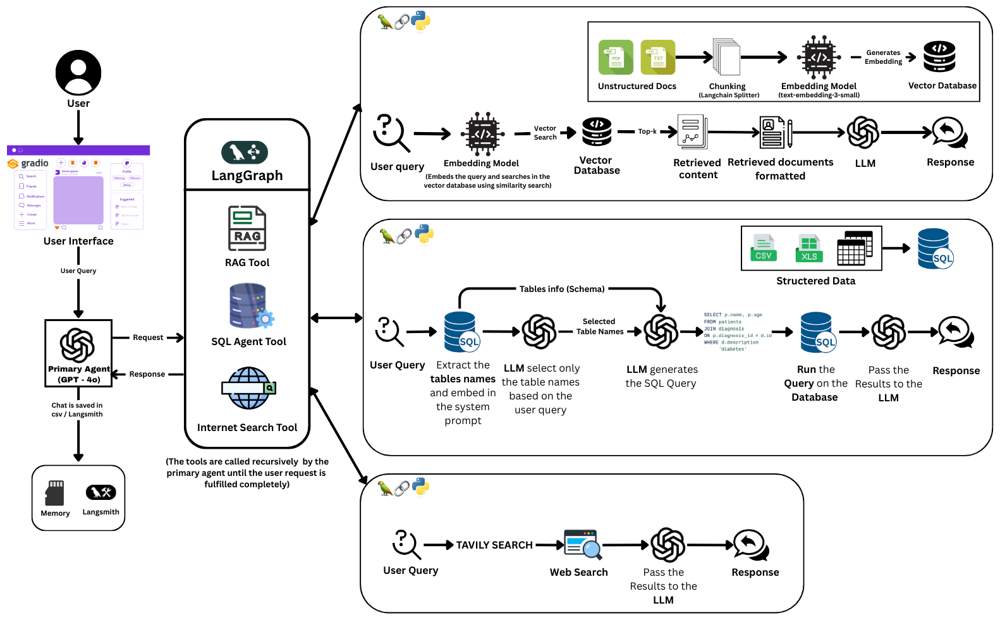

# AgentGraph: Intelligent SQL-agent Q&A and RAG System for Chatting with Multiple Databases

This project demonstrates how to build an agentic system using Large Language Models (LLMs) that can interact with multiple databases and utilize various tools. It highlights the use of SQL agents to efficiently query large databases. The key frameworks used in this project include OpenAI, LangChain, LangGraph, LangSmith, and Gradio. The end product is an end-to-end chatbot, designed to perform these tasks, with LangSmith used to monitor the performance of the agents.

## Architecture Overview

The following diagram illustrates the complete workflow of the AgentGraph system, showing how different components interact to process user queries and generate responses:



The system architecture consists of three main processing paths:

1. **RAG Tool Path (Top)**: Handles unstructured document queries using vector embeddings and similarity search
2. **SQL Agent Tool Path (Middle)**: Processes structured database queries using intelligent SQL generation
3. **Internet Search Tool Path (Bottom)**: Performs web searches using Tavily for external information retrieval

The Primary Agent (GPT-4o) orchestrates these tools recursively until the user request is completely fulfilled, with all interactions monitored through LangSmith for performance tracking.

## Requirements

- **Operating System:** Linux or Windows (Tested on Windows 11 with Python 3.9.11 or above)
- **OpenAI API Key:** Required for GPT functionality.
- **Tavily Credentials:** Required for search tools (Free from your Tavily profile).
- **LangChain Credentials:** Required for LangSmith (Free from your LangChain profile).
- **Dependencies:** The necessary libraries are provided in `requirements.txt` file.

## Installation and Execution

To set up the project, follow these steps:

1. Clone the repository:
   ```bash
   git clone <repo_address>
   ```

2. Install Python and create a virtual environment:
   ```bash
   python -m venv venv
   ```

3. Activate the virtual environment:
   - On Windows:
     ```bash
     venv\Scripts\activate
     ```
   - On Linux/macOS:
     ```bash
     source venv/bin/activate
     ```

4. Install the required dependencies:
   ```bash
   pip install -r requirements.txt
   ```

5. Download a sql database from and paste it into the `data` folder.

6. Prepare the `.env` file and add your `OPEN_AI_API_KEY`, `TAVILY_API_KEY`, and `LANGCHAIN_API_KEY`.

7. Run `prepare_vector_db.py` module once to prepare the vector database.
   ```bash
   python src\prepare_vector_db.py
   ```

8. Run the app:
   ```bash
   python src\app.py
   ```

Open the Gradio URL generated in the terminal and start chatting.

*Sample questions are available in `SampleQuestions.txt`.*

## Using Your Own Database

To use your own data:

1. Place your data in the `data` folder.
2. Update the configurations in `tools_config.yml`.
3. Load the configurations in `src\agent_graph\load_tools_config.py`.

For unstructured data using Retrieval-Augmented Generation (RAG):

1. Run the following command with your data directory's configuration:
   ```bash
   python src\prepare_vector_db.py
   ```

All configurations are managed through YAML files in the `configs` folder, loaded by `src\chatbot\load_config.py` and `src\agent_graph\load_tools_config.py`. These modules are used for a clean distribution of configurations throughout the project.

Once your databases are ready, you can either connect the current agents to the databases or create new agents.

## Key Frameworks and Libraries

- **LangChain:** [Introduction](https://python.langchain.com/docs/get_started/introduction)
- **LangGraph**
- **LangSmith**
- **Gradio:** [Documentation](https://www.gradio.app/docs/interface)
- **OpenAI:** [Developer Quickstart](https://platform.openai.com/docs/quickstart?context=python)
- **Tavily Search**
